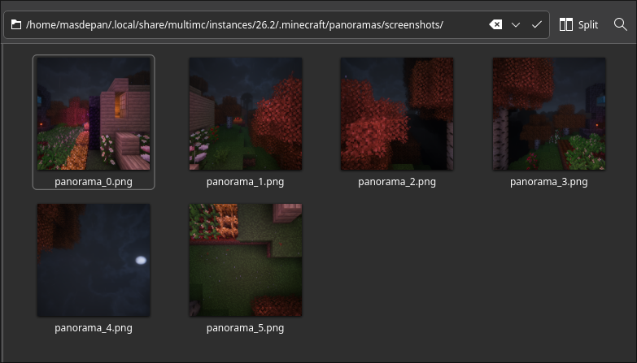
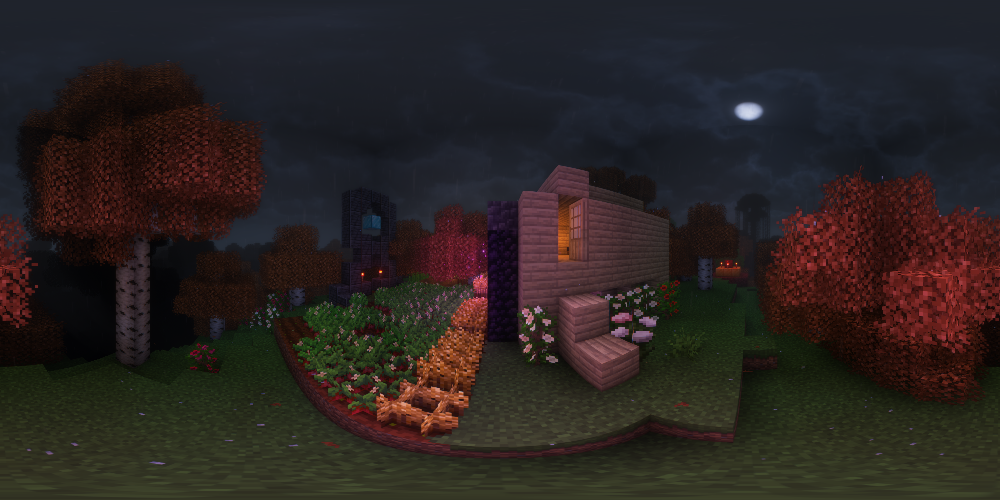

<div align="center">

<h1>MC Panorama to 360 image</h1>

Turn Minecraft Java panorama images into a single 360-degree equirectangular image.


</div>

## Table of Contents

- [Table of Contents](#table-of-contents)
- [Overview](#overview)
- [Features](#features)
- [Tech Stack](#tech-stack)
- [Demo](#demo)
  - [Before combining](#before-combining)
  - [After combining](#after-combining)
- [Installation](#installation)
- [Usage](#usage)
  - [Expected input files](#expected-input-files)
- [Project Structure](#project-structure)
- [Contributing](#contributing)
- [License](#license)
- [Contact / Author](#contact--author)

## Overview

`mc-panorama-to-360` converts Minecraft Java panorama cubemap images into one 360-degree equirectangular PNG. It reads the panorama files from a Minecraft panorama screenshots folder and writes the combined result into the `output` folder.

## Features

- Converts Minecraft Java panorama files into a single 360-degree image.
- Reads standard panorama files from `panorama_0.png` through `panorama_5.png`.
- Saves generated images to the `output` folder.
- Uses bilinear sampling for smoother image output.

## Tech Stack

- TypeScript
- Node.js
- Sharp

## Demo

### Before combining

The source folder should contain Minecraft panorama images before running the converter.



> [!WARNING]
> You need to use mod [Panorama ScreenMake](https://modrinth.com/mod/panorama_screen) to capture get this program work.

### After combining

The generated 360-degree image is saved in the `output` folder.



> [!TIP]
> Use a 360-degree image viewer such as [360 Photo Cam](https://360photocam.com/online-viewer/)

## Installation

```bash
git clone https://github.com/adwerygaming/mc-panorama-to-360.git
cd mc-panorama-to-360
npm install
```

## Usage

Run the converter with the path to the folder that contains the Minecraft panorama PNG files.

```bash
npm run start
```

The result is written to the `output` folder with a generated filename such as:

```text
output/output-1785835152642.png
```

### Expected input files

The input folder should contain these files:

```text
panorama_0.png
panorama_1.png
panorama_2.png
panorama_3.png
panorama_4.png
panorama_5.png
```

## Project Structure
```text
.
├── docs/
│   └── screenshots/
│       ├── before_combined.png
│       └── sample_result.png
├── output/
├── src/
│   ├── index.ts
│   ├── types/
│   └── utils/
├── package.json
├── tsconfig.json
└── tsup.config.ts
```

## Contributing

1. Fork the repository.
2. Create a feature branch.

   ```bash
   git checkout -b feature/your-change
   ```

3. Commit your changes.

   ```bash
   git commit -m "Add your change"
   ```

4. Push the branch.

   ```bash
   git push origin feature/your-change
   ```

5. Open a pull request.

## License

This project is licensed under the ISC License, as declared in `package.json`.

## Contact / Author

Created by [adwerygaming](https://github.com/adwerygaming).